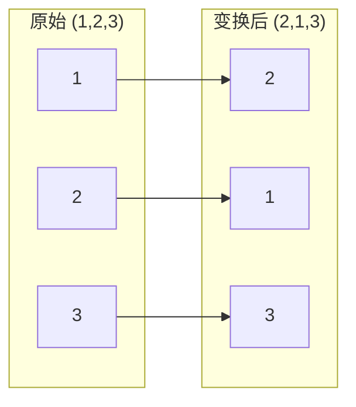

## 根置换的图形表示（两列 + 箭头）

这一节只做一件事：把“置换”画成图。

在伽罗瓦的思路里，我们关心的是：

> 当我们只知道某些信息时，**根还能被怎样互换而不被发现**？

所以第一步是：先把“互换”这个动作本身表达清楚。

下面用一个例子表示置换：

- 原始排列为 `(1,2,3)`
- 变换后为 `(2,1,3)`
- 也就是 `1→2，2→1，3→3`

读者只需要记住：**置换就是“把标签送到新位置”的规则**。后面的所有讨论，都是在研究“哪些置换是允许的”。

正常的图应该是前面 2 个是一个交叉的箭头但是 markdown 好像做不到
