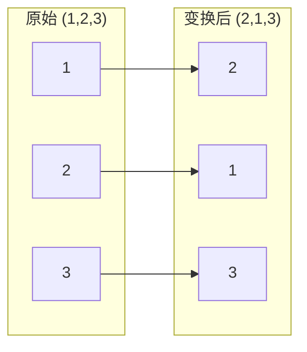

## 根置换的图形表示（两列 + 箭头）

下面用一个例子表示置换：  
原始排列为 (1,2,3)，变换后为 (2,1,3)。  
也就是：1→2，2→1，3→3。

```mermaid
flowchart LR
  %% 左列：原始排列
  subgraph L["原始 (1,2,3)"]
    direction TB
    L1["1"]
    L2["2"]
    L3["3"]
  end

  %% 右列：变换后排列
  subgraph R["变换后 (2,1,3)"]
    direction TB
    R1["2"]
    R2["1"]
    R3["3"]
  end

  %% 映射箭头（置换）
  L1 --> R1
  L2 --> R2
  L3 --> R3
```
