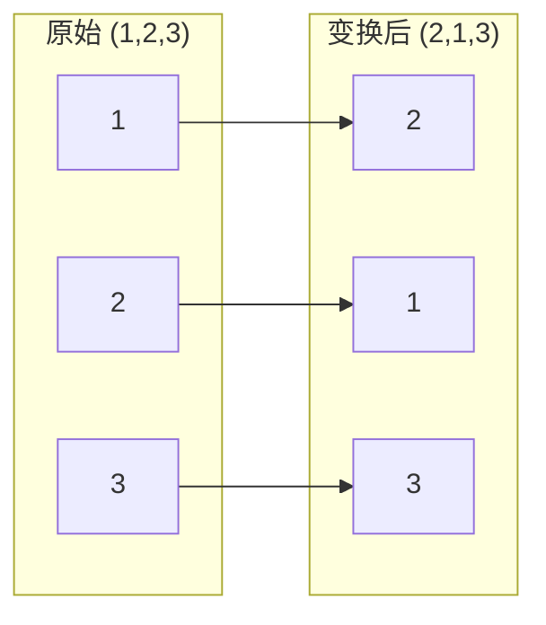
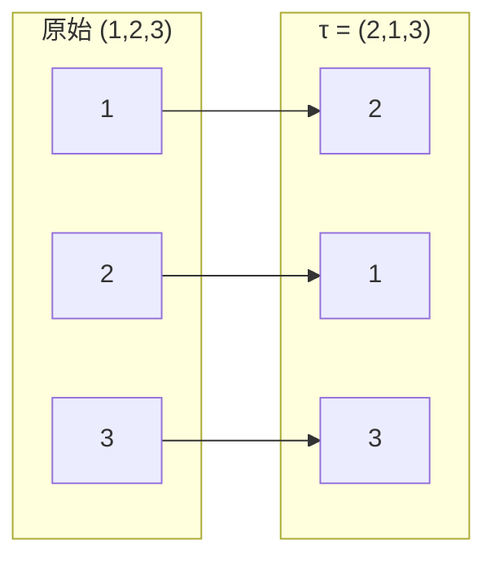
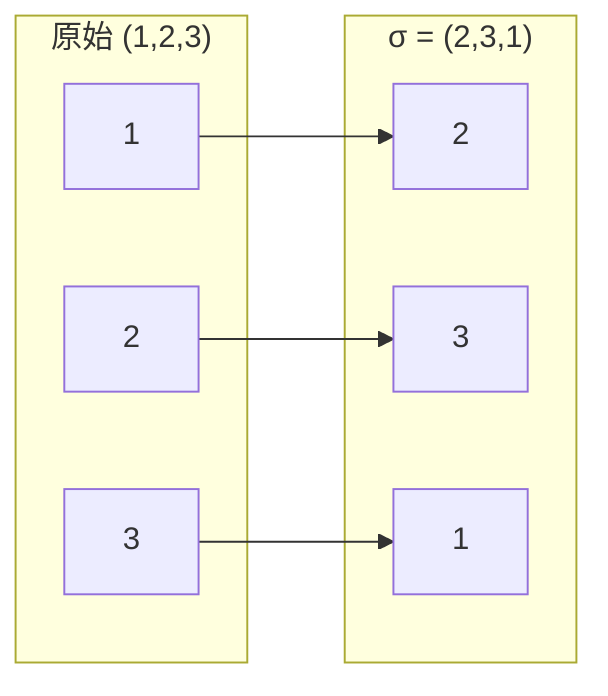

## 根置换的图形表示（两列 + 箭头）

这一节只做一件事：把“置换”画成图。

在伽罗瓦的思路里，我们关心的是：

> 当我们只知道某些信息时，**根还能被怎样互换而不被发现**？

所以第一步是：先把“互换”这个动作本身表达清楚。

下面用一个例子表示置换：

- 原始排列为 `(1,2,3)`
- 变换后为 `(2,1,3)`
- 也就是 `1→2，2→1，3→3`

读者只需要记住：**置换就是“把标签送到新位置”的规则**。后面的所有讨论，都是在研究“哪些置换是允许的”。

正常的图应该是前面 2 个是一个交叉的箭头但是 markdown 好像做不到

## 根置换排列（只用于分组，不要求背表）

> $S_n$ 表示由 $(n)$ 个元素的所有置换组成的集合，也就是“对 $(n)$ 个根进行任意重新排列”
> 2 个根太简单了没有必要列出来

这一节的目标不是让你记住数量，而是让你熟悉几种“常见动作类型”，因为后面我们会用这些类型来做直觉分块。

在 **S₃** 中：

- **identity（全部不动）**：**1 个**
- **transposition（2 个交换，1 个不动）**：**3 个**
- **3-cycle（3 个轮换）**：**2 个**

合计：(3 + 2 + 1 = 6)。 $3!$

在 **S₄** 中，按“置换类型”只列**数量**：

- **identity（全不动）**：1
- **transposition（2 个交换，其余不动）**：6
- **double transposition（两对同时交换）**：3
- **3-cycle（3 个轮换，1 个不动）**：8
- **4-cycle（4 个轮换）**：6

合计：(1 + 6 + 3 + 8 + 6 = 24)。 $4!$

在 **S₅** 中，按置换类型只列**数量**：

- **identity（全不动）**：1
- **transposition（1 对交换，其余不动）**：10
- **double transposition（两对交换，1 个不动）**：15
- **3-cycle（3 个轮换，2 个不动）**：20
- **3-cycle + transposition（3 轮换 + 1 对交换）**：20
- **4-cycle（4 个轮换，1 个不动）**：30
- **5-cycle（5 个轮换）**：24

合计：(1+10+15+20+20+30+24=120)。 $5!$

小提醒：

- 这些“类型”可以理解成置换的几种常见动作外观。
- 我们列数量的目的，是为了后面判断“某种切法能不能把整体均匀地分成几块”。

---

### 用 S₃ 的两个具体动作，看“同类动作”的直觉差别

在 S₃ 中，我们至少需要看 **两种完全不同的动作外观**，
否则“分组”很容易被误解成只是“数字换来换去”。

下面我们选两个代表性的置换：

- **τ**：交换两个，第三个不动（transposition）
- **σ**：三个依次轮换（3-cycle）

---

#### 例子一：τ = (2,1,3) —— 交换两个，留一个

这个动作做的事情是：

- 1 和 2 对调
- 3 完全不受影响

这个图表达的是一种**非常直观的动作外观**：

> **两个位置被对调，另一个完全不动。**
> 本图型前面 2 个箭头需要交叉 markdown 确实无法实现

在 S₃ 里，所有“交换两个、留一个”的动作，都和 τ 属于同一类。

---

#### 例子二：σ = (2,3,1) —— 三个一起轮换

现在看另一种完全不同的动作：

- 1 → 2
- 2 → 3
- 3 → 1

这个动作的外观和 τ 完全不同：

> **没有“留下不动”的位置，
> 三个一起被推着往前走了一步。**
> 本图型箭头需要自己再画一下 markdown 确实无法实现。可以想象成相同数字才有箭头(2-2 向上, 3-3 向上, 1-1 向下)

在 S₃ 里，所有这种“三个一起转圈”的动作，都和 σ 属于同一类。

---

### 为什么 τ 和 σ 不能混在同一组？

现在可以不用任何抽象概念，只凭直觉判断：

- τ：

  - 有“被交换的两个”
  - 有“完全不动的一个”

- σ：

  - 没有不动的
  - 所有元素都参与了变化

**这两种动作在“长相”和“行为方式”上完全不同。**

所以当我们按“动作类型”给 S₃ 分组时：

- 所有 τ 这一类的动作，必须放在一起
- 所有 σ 这一类的动作，也必须放在一起
- 而不能把它们随意混合

---

### 这一点在后面会变得非常重要

这里你暂时只需要记住一句话：

> **分组不是按“换了谁”，
> 而是按“是怎么动的”。**

后面当我们讨论
“什么样的切割不是随便分类”，
你会发现：
**τ 和 σ 这种“动作外观的差异”，正是那把刀要顺着切的纹理。**
